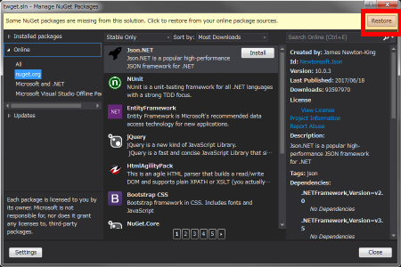
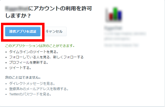
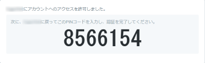
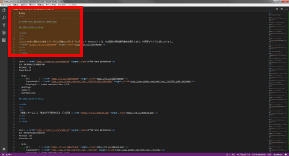
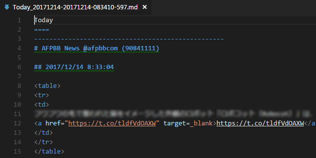
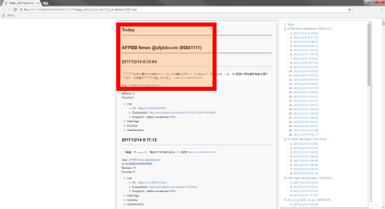
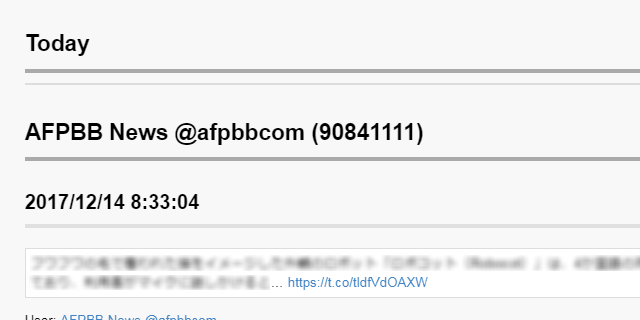

twget
====

Twitter からツイートなどのデータを収集する C# のコンソールアプリケーションです。  
ライブラリは [CoreTweet](https://github.com/CoreTweet) を使用しています。  

**目的**  
このプロジェクトは CoreTweet を使用した処理の (非公式な) サンプルを目的にしています。
逐次実行型ですので処理内容は簡素です。

# 構築から実行まで

実行する前に下記の作業を行う必要があります。

1. NuGet パッケージの取得
2. Twitter API Key の設定
3. アプリケーションのビルド

## NuGet パッケージの取得

本ソフトウェアが依存しているライブラリ (CoreTweet とその関連) を NuGet から取得してください。  

- TOOLS メニューの "NuGet Package Manager" の "Manager NuGet Packages for Solution" を選択します。
- 表示された "Manage Nuget Packages" ダイアログの右上に表示されている [Restore] ボタンを押下します。

※関連: packages.config ファイル

## Twitter API Key の設定

Text Editor または Solution Explorer で app.config を開いて
ConsumerKey 及び ConsumerSecret の value に設定する値を編集してください。
初期状態はダミーの値(your_consumer_key, your_consumer_secret)が設定されています。

図) app.config ファイル

	<?xml version="1.0" encoding="utf-8"?>
	<configuration>
		<startup>
			<supportedRuntime version="v4.0" sku=".NETFramework,Version=v4.5.2"/>
		</startup>
		<appSettings>
			<add key="ProjectDir" value="(MyDocuments)" />
			<add key="ConsumerKey" value="your_consumer_key" />
			<add key="ConsumerSecret" value="your_consumer_secret" />
		</appSettings>
	</configuration>

※参考：  
ConsumerKey/ConsumerSecret は、[Twitter Apps](https://apps.twitter.com/) で確認できます。
これらは Twitter App 毎に割り振られた Key です。
まだ、Twitter App を作成していない場合は、当サイトの [Create New App] ボタンを押下して作成してください。
尚、Twitter App を作成するには「Twitter のモバイル認証」が必要です。

## アプリケーションのビルド

以下の何れかの方法でビルドしてください。

- プロジェクトを Visual Studio で開いてビルドする方法
- \_build バッチファイルを実行してビルドする方法

## 実行

コマンドプロンプトを開き、実行ファイルが在る位置へ移動してください。  
適当なコマンド (例：twget /trends) を実行してください。  
実行するとブラウザが起動されますので、次のように画面の指示に従って進んでください。  

[連携アプリを認証] ボタンを押下して次へ進みます。

PIN コードが表示されます。

表示された PIN コードをコマンドプロンプトに入力して enter キーを押下してください。

	C:\dev\twget\bin\Release>twget /trends
	：
	(中略)
	：
	Input PIN code. _ 8566154	← PIN コードを入力して enter キーを押下してください。
	Limit:180 Remaining=179 Reset=yyyy/mm/dd HH:MM:SS
	C:\dev\twget\bin\Release>

認証情報は下記 XML ファイルに保存されます。  
次回から当情報でログインするので PIN コード入力を省略できます。  

|項目|値|備考|  
|----|--|----|  
|ファイル|Tokens.xml|※1|  
|ディレクトリ|(MyDocuments)\\twget-1.0|※2|  

※1) 当ファイル内に Twitter App の情報が記載されているので流出しないようご注意ください。  
※2) (MyDocuments) は、既定では C:\\Users\\(username)\\Documents です。  

# 処理結果

収集したデータはテキストファイルに保存します。  
ファイル名はコマンド毎に異なります。  
詳しくは後述の "使用方法" をご参照ください。  

内部の書式は markdown 形式 (※注) です。  
※注) HTML タグも混在しています。  

-----

図1) 保存された markdown 形式のテキストファイル  

▽ 上図赤枠部分  

-----

図2) markdown viewer での表示例  

▽ 上図赤枠部分  

# 使用方法

下記のように引数に /? を渡すと使用方法を表示します。

	C:> twget /?

	Usage:
	   twget.exe [command]
	   twget.exe [switch] [arguments]

	Command)
	   /? ... show help.
	   /v ... show version.

	Trends list
	   twget.exe /trends

	Friends list
	   twget.exe /friends

	Today Timeline
	   twget.exe /today:(offset_days)
	   params)
	   - offset_days = 0~

	Home Timeline
	   twget.exe /home:(count)
	   params)
	   - count = 1~
	   ex)
	   > twget.exe /home:10

	User Timeline
	   twget.exe /user:(count) (screen_name)
	   params)
	   - count = 1~
	   - screen_name = user screen name
	   ex)
	   > twget.exe /user:10 taro

	Search
	   twget.exe /search:(count) keywords...
	   ex)
	   > twget.exe /search:100 #camera sigma OR nikon

## トレンドキーワードの一覧

	twget /trends

本日のトレンドキーワードの一覧を取得します。  
取得したデータは下記書式のファイルに保存します。  

|項目|値|備考|  
|----|--|----|  
|書式|Trends-(実行日時).md||  
|例|Trends-20171216\_081523\_094.md||  

## フォロー中のユーザーの一覧

	twget /firends

自身がフォローしているユーザーの一覧を取得します。  
取得したデータは下記書式のファイルに保存します。  

|項目|値|備考|  
|----|--|----|  
|書式|Friends-(実行日時).md||  
|例|Friends-20171216\_081523\_094.md||  

## 本日のタイムライン

	twget /today:(offset_days)

自身のホームタイムラインを取得して下記のように成型して保存します。  

- 1 日単位（1 ファイル／１日分）に分割します。  
- 各ツイートをユーザー毎にグルーピングします。  

※ 時刻はローカルタイムです。日本では UTC+0900 になります。

取得したデータは下記書式のファイルに保存します。  

|項目|値|備考|  
|----|--|----|  
|書式|Today_(起源)-(実行日時).md||  
|例|Today_20171215-20171216\_081523\_094.md|2017-12-15 0:00 以降の 1 日分を意味します。|  

例）本日の 0:00 以降を取得します。

	twget /today

例）本日より 2 日前の 0:00 以降を取得します。

	twget /today:2

## ホームタイムライン

	twget /home:(count)

自身のホームタイムラインを指定数分取得します。  
取得したデータは下記書式のファイルに保存します。  

|項目|値|備考|  
|----|--|----|  
|書式|HomeTimeline-(実行日時).md||  
|例|HomeTimeline-20171216\_081523\_094.md||  

例）最新の投稿を 10 件取得します。

	twget /home:10

## ユーザータイムライン

	twget /user:(count) (screen_name)

指定ユーザーのタイムラインを指定の件数分取得します。  
取得したデータは下記書式のファイルに保存します。  

|項目|値|備考|  
|----|--|----|  
|書式|UserTimeline-(実行日時).md||  
|例|UserTimeline-20171216\_081523\_094.md||  

例）taro と言うユーザーの投稿を 100 件取得する例です。

	twget /user:100 taro

## 検索

	twget /search:(count) keywords...

任意のキーワードを指定してツイートを検索します。  
過去 7 日以内に制限されています。  

取得したデータは下記書式のファイルに保存します。  

|項目|値|備考|  
|----|--|----|  
|書式|Search-(実行日時).md||  
|例|Search-20171216\_081523\_094.md||  

例）指定キーワード (#camera nikon OR canon) に一致する投稿を検索します。

	twget /search:50 #camera nikon OR canon

例）リツイートを除外する場合は下記のように exclude:retweets を指定します。

	twget /search:50 昼休み 消灯 exclude:retweets

# トラブルシューティング

## 回数制限 (Rate Limit)

回数制限 (Rate Limit) に達すると例外が発生して取得できなくなります。  
その場合は、リセット時刻 (Reset) まで待機する必要があります。  
リセット時刻 (Reset) は各コマンドの実行前に表示しています。  

	C:> twget /today
	Limit:180 Remaining=178 Reset=2017/11/15 13:55:44
	Limit:180 Remaining=177 Reset=2017/11/15 13:55:44 items=100 users=15 prev_id: last_id:930601512241217537
	Limit:180 Remaining=176 Reset=2017/11/15 13:55:44 items=200 users=16 prev_id:930601512241217537 last_id:930487512459382784
	Limit:180 Remaining=175 Reset=2017/11/15 13:55:44 items=220 users=17 prev_id:930487512459382784 last_id:930450824261767168

関連：
- CoreTweet.Tokens.Application プロパティ  
- CoreTweet.Rest.Application.RateLimitStatus メソッド  

# ライセンス

本リポジトリに含まれる twget のソースコード（以下、本ソフトウェア）の使用は以下の条件に従って許可されます。  
但し、本ソフトウェアが依存する第三者の著作物については、それぞれのライセンスに従ってください。  

1. 使用条件  
   本ソフトウェアの全部または一部を改変または未改変の状態に関わらず自身のソフトウェアの一部として使用することができます。
   本ソフトウェアを使用した自身のソフトウェアを配布するにあたり、ソースコードの公開または非公開の条件に関わらず、
   追加のライセンスを適用することができます。
   但し、本ソフトウェアが依存する第三者の著作物のライセンスと矛盾しない条件でなければなりません。
2. 免責事項  
   本ソフトウェアの著作者は、明示的または暗黙的を問わず、
   本ソフトウェアに起因または関連して生じる如何なる保証および賠償から免責されるものとします。  

# 著作者

[cogorou](https://github.com/cogorou)

Eggs Imaging Laboratory
